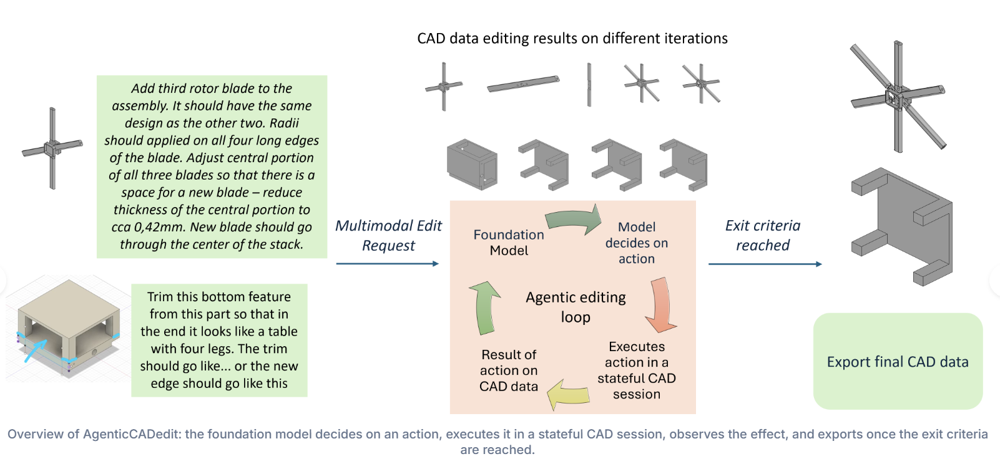

# AgenticCADedit

This repository contains the code for **AgenticCADedit**, a stateful, tool-mediated agentic approach to multimodal 3D CAD editing, introduced in the paper:

**[AgenticCADedit: A Stateful, Tool-Mediated Agentic Approach to Multimodal 3D CAD Editing](https://arxiv.org/abs/2609.29621)**

🌐 **Project page:** https://agenticcadedit.github.io/
📄 **Paper (arXiv):** https://arxiv.org/abs/2609.29621



> **Note:** This code has been adapted from [AutodeskAILab/neuralCAD-Edit](https://github.com/AutodeskAILab/neuralCAD-Edit) (Perrett et al., *neuralCAD-Edit: An Expert Benchmark for Multimodal-Instructed 3D CAD Model Editing*). We reuse their dataset, file structure and evaluation protocol unchanged, and add a stateful agentic editing harness on top.

---

## Overview

Computer-aided design is central to industrial manufacturing, and much of a designer's daily work consists of editing existing models from multimodal requests involving speech, sketches and model interaction. Existing iterative baselines refine a *complete* CAD program across attempts, executing each attempt from the original model in a stateless CAD environment. Every attempt must therefore reconstruct the entire edit from scratch, so partially correct progress is discarded rather than accumulated, and the model can neither inspect the geometry it has just produced nor selectively revert a single faulty operation.

**AgenticCADedit** turns editing into a sequence of small, verifiable actions on a **persistent CAD state**. An LLM operates inside a persistent **CadQuery** session exposed through a **Model Context Protocol (MCP)** server. Instead of emitting one complete program, it applies incremental code steps that each commit to the session, inspects the resulting faces and edges numerically, renders highlighted selections to verify that the intended region was addressed, and reverts individual operations when it was not. Subsequent actions therefore build on the geometry produced by earlier ones.

We evaluate on a benchmark of 192 expert multimodal editing requests without modifying the benchmark or its evaluation protocol, so differences come from the interaction paradigm alone.

---

## What we provide

- The agentic editing harness with a persistent CadQuery session behind an MCP server.
- The MCP tool interface for incremental editing, geometry inspection, rendered verification and state management (`undo`, `reset`, `export_cad`).
- The original script-refinement harness for direct comparison.
- Code for accessing the benchmark data (192 editing requests, 384 reference edits).
- Notebooks for visualising and analysing the data and results.
- All outputs of the foundation models we run in the paper (qwen3.6-27b, gemma4-31b, gpt-5.6-luna).
- All automatic and VLM-based evaluations, including token-cost logs.

---

## MCP tool interface

| Category | Tool | Purpose |
|---|---|---|
| Edit | `run_step` | Executes CadQuery code in the persistent session; restores the previous state on error |
| Query | `inspect` | Face/edge counts and axis-aligned bounding box of the current model |
| Query | `list_faces` | Enumerates faces (surface type, area, center, outward normal), sorted by area |
| Query | `list_edges` | Enumerates edges (type, length, center, radius), sorted by length |
| Render | `render_views` | Renders selected viewpoints, optionally highlighting faces or edges |
| State | `export_cad` | Exports the current CAD model |
| State | `undo` | Reverts the last successful edit |
| State | `reset` | Clears the session and edit history |
| Virtual | `finish` | Signals that the model considers the edit complete and terminates the loop |

---

## Setup

Everything runs in Docker. The provided `Dockerfile` builds a CUDA 11.8 image with Python 3.12, CadQuery, vLLM, the MCP SDK, `xvfb` for headless rendering, and all evaluation dependencies.

### Clone the repo

```bash
git clone --recurse-submodules https://github.com/agenticCADedit/agenticCADedit.git
```
## Download and visualise data

1. Download the pre-computed database from the benchmark release: <https://huggingface.co/datasets/autodesk/neuralCAD-Edit>
2. Set `storage_dir` in `src/config/edit_192_external.json` to where the data has been saved (inside the container, e.g. `/data/edit_192_external`).
3. You're good to go — try `src/notebooks/visualise_examples.ipynb` to look at some of the data.

## Running the benchmark with Docker

A single launcher serves the model with vLLM and runs either benchmark arm
inside the project image. It is configured entirely through environment
variables, so there are no site-specific paths.

```bash
chmod +x docker/run_benchmark.sh
```

### 1. Build the image

```bash
docker build -t agentic-cad-edit .
```

### 2. Prepare the dataset

Download the benchmark release and unpack it so that the following path exists:

```
<DATA_DIR>/edit_192_external/parquets
```

Set `storage_dir` in `src/config/edit_192_external.json` to the **container**
path, i.e. `/data/edit_192_external`.

### 3. Run an arm

Ours (stateful agentic MCP loop):

```bash
DATA_DIR=/path/to/neuralcad-data \
MODEL=Qwen/Qwen3.6-27B \
MODEL_TAG=qwen3.6-27b \
TENSOR_PARALLEL=4 \
docker/run_benchmark.sh mcp
```

Baseline (stateless full-program script refinement):

```bash
DATA_DIR=/path/to/neuralcad-data \
MODEL=Qwen/Qwen3.6-27B \
MODEL_TAG=qwen3.6-27b \
TENSOR_PARALLEL=4 \
docker/run_benchmark.sh script
```

Both arms sequentially:

```bash
DATA_DIR=/path/to/neuralcad-data MODEL_TAG=qwen3.6-27b docker/run_both_arms.sh
```

Smoke test on a handful of tasks:

```bash
DATA_DIR=/path/to/neuralcad-data N_ROWS=2 docker/run_benchmark.sh mcp
```

### 4. Use an existing endpoint or a proprietary API

Skip the built-in vLLM server and point the harness at any OpenAI-compatible
endpoint:

```bash
SKIP_VLLM=1 \
VLLM_BASE_URL=http://my-inference-host:8000/v1 \
DATA_DIR=/path/to/neuralcad-data \
MODEL_TAG=my-model \
docker/run_benchmark.sh mcp
```

For proprietary models, set `SKIP_VLLM=1`, select the model in the config, and
export the relevant provider key (`OPENAI_API_KEY`, `ANTHROPIC_API_KEY`,
`GOOGLE_API_KEY`); the launcher forwards them into the container.

### Configuration reference

| Variable | Default | Purpose |
|---|---|---|
| `DATA_DIR` | *(required)* | Host directory containing the dataset; mounted at `/data` |
| `DATASET_NAME` | `edit_192_external` | Dataset subdirectory under `DATA_DIR` |
| `MODEL_TAG` | `my-model` | Prefix for the generated `--userId` |
| `USER_ID` | `<MODEL_TAG>_cadquery-<arm>` | Explicit edit-user id |
| `CONFIG` | `src/config/<DATASET_NAME>.json` | Benchmark config |
| `N_ROWS` | `999999` | Limit the number of tasks |
| `IMAGE` | `agentic-cad-edit:latest` | Project image |
| `PROJECT_DIR` | repo root | Host path mounted at `/workspace/AgenticCADedit` |
| `SKIP_VLLM` | `0` | `1` = do not start vLLM, use `VLLM_BASE_URL` |
| `VLLM_IMAGE` | `vllm/vllm-openai:latest` | Serving image |
| `MODEL` | `Qwen/Qwen3.6-27B` | Model to serve |
| `MODEL_REVISION` | *(unset)* | Pin a specific model revision |
| `TENSOR_PARALLEL` | `4` | Number of GPUs for tensor parallelism |
| `MAX_MODEL_LEN` | `262144` | Context length |
| `MAX_IMAGES` | `256` | `--limit-mm-per-prompt` image budget |
| `TOOL_CALL_PARSER` | `qwen3_coder` | Tool-call parser (MCP arm only) |
| `REASONING_PARSER` | `qwen3` | Reasoning parser |
| `VLLM_PORT` | `8000` | Host port for the endpoint |
| `VLLM_READY_ATTEMPTS` | `360` | Readiness polls (×10 s) |
| `HF_CACHE` | `~/.cache/huggingface` | Hugging Face cache mount |
| `HF_TOKEN` | *(unset)* | Token for gated models |
| `GPUS` | `all` | Value passed to `--gpus` |

### Notes

- Results are written in place to
  `<DATA_DIR>/<DATASET_NAME>/model_edits/<USER_ID>`; nothing is copied anywhere
  else.
- The MCP arm needs tool calling, so the launcher adds
  `--enable-auto-tool-choice` and a matching `--tool-call-parser` automatically.
  The script arm runs without tool calling.
- Videos are sampled client-side at a deterministic 0.5 fps and sent as
  `image_url` blocks, so the server only needs image support. Raise `MAX_IMAGES`
  if the longest request exceeds the budget.
- Rendering runs under `xvfb-run`, so no display is required on the host.
- Run on a scheduler by wrapping the launcher in your own job script, e.g.
  `srun docker/run_benchmark.sh mcp` or an equivalent Kubernetes job; the script
  itself makes no assumptions about the scheduler.


### Models evaluated in the paper

| Model | Access |
|---|---|
| qwen3.6-27b | Self-hosted via vLLM, 4× NVIDIA A100 (40 GB) |
| gemma4-31b | Self-hosted via vLLM, 4× NVIDIA A100 (40 GB) |
| gpt-5.6-luna | Public API, reasoning effort `high` |


---

## Evaluation

We follow the benchmark protocol unchanged: Chamfer distance, voxel IoU, DINOv2 similarity on isometric renders, validity, and VLM ratings for instruction following, model quality and acceptance. Instruction and quality are rated 1–7 and normalised to [0, 1]; acceptance requires both scores to be at least 5. Failed or invalid edits are scored as zero in the mean evaluation.

## Contributors

- **Saptarshi Neil Sinha** — project administration and conceptualization
- **Mika Goschke** — implementation, experiments and evaluation


## License

This project is released under the **MIT License**. See [LICENSE](LICENSE) for the full text.

```text
MIT License

Copyright (c) 2026 AgenticCADedit authors

Permission is hereby granted, free of charge, to any person obtaining a copy
of this software and associated documentation files (the "Software"), to deal
in the Software without restriction, including without limitation the rights
to use, copy, modify, merge, publish, distribute, sublicense, and/or sell
copies of the Software, and to permit persons to whom the Software is
furnished to do so, subject to the following conditions:

The above copyright notice and this permission notice shall be included in all
copies or substantial portions of the Software.

THE SOFTWARE IS PROVIDED "AS IS", WITHOUT WARRANTY OF ANY KIND, EXPRESS OR
IMPLIED, INCLUDING BUT NOT LIMITED TO THE WARRANTIES OF MERCHANTABILITY,
FITNESS FOR A PARTICULAR PURPOSE AND NONINFRINGEMENT. IN NO EVENT SHALL THE
AUTHORS OR COPYRIGHT HOLDERS BE LIABLE FOR ANY CLAIM, DAMAGES OR OTHER
LIABILITY, WHETHER IN AN ACTION OF CONTRACT, TORT OR OTHERWISE, ARISING FROM,
OUT OF OR IN CONNECTION WITH THE SOFTWARE OR THE USE OR OTHER DEALINGS IN THE
SOFTWARE.
```

---

## Citation

If you use this code, please cite our paper:

```bibtex
@misc{sinha2026agenticcadedit,
  title={AgenticCADedit: A Stateful, Tool-Mediated Agentic Approach to Multimodal 3D CAD Editing},
  author={Saptarshi Neil Sinha and Mika Silvan Goschke and Paul Julius Kühn and Arjan Kuijper and Michael Weinmann},
  year={2026},
  eprint={2609.29621},
  archivePrefix={arXiv},
  primaryClass={cs.CV},
  url={https://arxiv.org/abs/2609.29621}
}
```